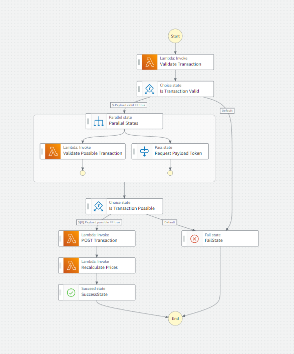

# Welcome to Track App!

The track app tracks data and is a way to fullfill a personal need, while applying the professional skills that I'm interested in.

## Users

## Features

1. Portfolio

    i. Current State

    ii. Evolution

2. Watchlist

3. Price Calculator

4. End-position decision Feedback

5. Authentication

## Workflows

1. GET Portfolio

2. POST transaction 
    

## External API

1. Google Finance

    i. curr_price

    ii. price vs. time

## Persistence

### Tables:
1. Portfolio: 
TICKER | Quantity | BuyPrice 
2. Transactions
DATE | orderType | TICKER | Quantity | VALUE | FEES

